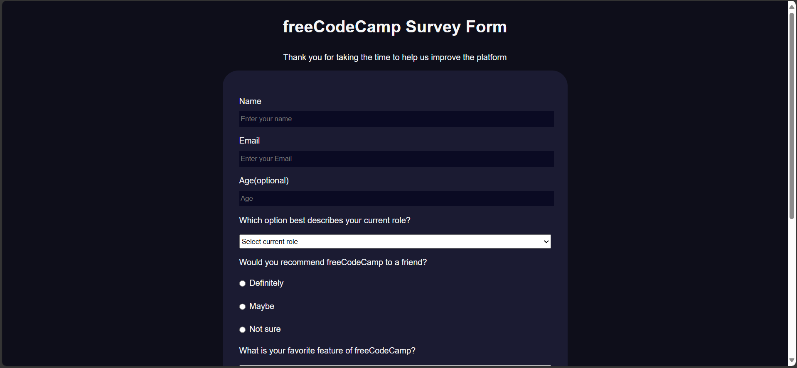

# Formulario de Encuesta - Proyecto de freeCodeCamp

Este proyecto consiste en un formulario de encuesta desarrollado como parte de la certificación de freeCodeCamp. El objetivo del formulario es recopilar información sobre la experiencia de los usuarios en la plataforma.

## Tecnologías utilizadas

- **HTML**: Para estructurar los elementos del formulario.
- **CSS**: Para estilizar el diseño, creando una experiencia visual agradable y responsive.

## Características

- **Formulario interactivo**: Incluye campos obligatorios como nombre, correo electrónico y selección de opciones.
- **Componentes adicionales**: Uso de botones de radio, listas desplegables y casillas de verificación para recolectar datos variados.
- **Diseño adaptable**: Compatible con dispositivos móviles y pantallas de diferentes tamaños.
- **Validación básica**: Implementada en campos obligatorios para mejorar la experiencia del usuario.

## Captura del proyecto



## Cómo utilizar este proyecto

1. Clona este repositorio:
   ```bash
   git clone https://github.com/daniel2048f/Responsive-Web-Design-First-Project-Free-Code-Camp
   ```
2. Abre el archivo `index.html` en tu navegador para visualizar el formulario.

## Próximos pasos

- Implementar funcionalidades adicionales usando JavaScript (opcional).
- Agregar una funcionalidad de backend para enviar los datos a un servidor (opcional).

## Contribuciones

Si deseas contribuir a este proyecto, siéntete libre de abrir un pull request o reportar problemas en el repositorio.

## Autor

Desarrollado por [Tu Nombre]. Este proyecto forma parte de los retos de certificación de freeCodeCamp.
